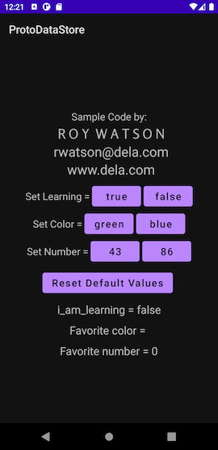

### "AndroidPrefsDataStoreExample" example project by:

##       Roy Watson

rwatson@dela.com

www.dela.com

This is a simple example that strips out a lot of generally accepted architectural components and other proclaimed best practices. It is using the minimum of dependencies, frameworks and libraries in order to avoid obscuring the illustration of using androidx's *PreferencesDataStore*. 

##### Branches:

"start" branch is the raw templated project created by Android Studio Chipmunk | 2021.2.1 Patch 2. This is supplied for comparison purposes.  ***It appears you are currently on this branch.***

"complete" branch is the example/tutorial application where the "magic"😀 happens. 

##### This example demonstrates/teaches:

- Preferences DataStore API

##### This example also includes/uses:

- Kotlin
- ViewModel
- Coroutines & Flows
- LiveData
- Repository pattern
- Custom font in xml layout

### How to best use this demo:

The starting point of this app was the template for a new project in Android Studio Chipmunk | 2021.2.1 Patch 2 called “Fragment + ViewModel” and using Kotlin. You can create an empty project based on that template and compare it to this project to discern what needs to be done to get your project started with the Room database library. 

First, as always, we need to add the necessary dependencies to the project. In the app level build.gradle file I hsve marked my additions with comments. Don't forget the new last section at the bottom of the app level build.gradle file called protobuf {}.These additions might in turn require version updates to other dependencies and settings. Once you have made my additions, Android Studio will help you identify the other required changes. Be patient as it might take a few iterations and pay close attention to the build output messages. 	

First in <ProjectRoot>/app/src/main/proto/my_prefs.proto I defined he protobuffer that will hold our preferences. The comments in that .proto file will guide you to reference material about protobuffers and .proto file syntax.

Next, in com.delasystems.androidprotodatastoreexample.data.MyPrefsSerializer.kt, I created a serializer to help read and write the protobuffers holding the preferences. This is a simple generic serializer that serves our purpose.

Then I created a repository to handle the actual reading and writing of the preferences protobuffers. The methods in the repository are called from the ViewModel in response to stimuli from the UI in MainActivity.

You can find a discussion of using this API at https://developer.android.com/topic/libraries/architecture/datastore .

Thank you and if you have any comments or questions please feel free to contact me at rwatson@dela.com

## License:

    Copyright (C) 2022 Roy Watson
    
    Permission is hereby granted, free of charge, to any person obtaining a copy of this
    software and associated documentation files (the "Software"), to deal in the Software 
    without restriction, including without limitation the rights to use, copy, modify, merge, 
    publish, distribute, sublicense, and/or sell copies of the Software, and to permit persons 
    to whom the Software is furnished to do so, subject to the following conditions:
    
    The above copyright notice and this permission notice shall be included in all copies 
    or substantial portions of the Software.
    
    THE SOFTWARE IS PROVIDED "AS IS", WITHOUT WARRANTY OF ANY KIND, EXPRESS OR IMPLIED, 
    INCLUDING BUT NOT LIMITED TO THE WARRANTIES OF MERCHANTABILITY, FITNESS FOR A PARTICULAR
    PURPOSE AND NONINFRINGEMENT. IN NO EVENT SHALL THE AUTHORS OR COPYRIGHT HOLDERS BE LIABLE
    FOR ANY CLAIM, DAMAGES OR OTHER LIABILITY, WHETHER IN AN ACTION OF CONTRACT,
    TORT OR OTHERWISE, ARISING FROM, OUT OF OR IN CONNECTION WITH THE SOFTWARE OR THE USE
    OR OTHER DEALINGS IN THE SOFTWARE.

